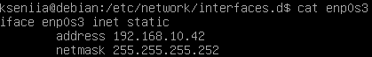

# roger-skyline-1

## V.1 VM Part
***hypervisor:*** VirtualBox; ***Linux OS:*** Debian(64-bit); size of the hard disk is 8.00 GB(VDI, fixed size);
Next you should run the virtual machine and specify the image of the OS - i downloaded `debian-10.1.0-amd64-netinst.iso` from https://www.debian.org/distrib/.


Then you need to set up you Debian, process is quite simple, but i'll pay some attention on `Partition disks` part. Choose `Partition method` as `manual` and next choose:


then:


go for `Create a new partition` and specify new partition size:


choose type and location (i choosed beggining); choose file system(i went for `/ - the root file system`):


i created 2 partitions: one `primary` with mout point on the `/ (root)` of OS and with 4.2GB capacity, second `logical` with mount point on the `/home` dir and 4.4GB of space:


then go for `Finish partitioning and write changes to disk`.
Finally, i did not install desktop envirinment; GRUB i accepted.
## V.2 Network and Security Part
### You must create a non-root user to connect to the machine and work.
Non-root login was created while setting up the OS. Just log in.
### Use sudo, with this user, to be able to perform operation requiring special rights.
First, we need to install `sudo`, what we can do only as root, so:
```
$ su
$ apt-get update -y && apt-get upgrade -y
$ apt-get install sudo vim -y
```
exit root mode:
```
$ exit
```
but now, if we'll try to use `sudo`, the OS will respond: `kseniia is not in the sudoers file. This incident will be reported`. That means we need to open `/etc/sudoers` file (again under the root). Don't forget to check rights on the file (must be writible!).
```
$ pwd
/etc
$ chmod +w sudoers
$ vim sudoers
```
add `username ALL=(ALL:ALL) ALL` to `# User priviliege specification` section:


### We don’t want you to use the DHCP service of your machine. You’ve got to configure it to have a static IP and a Netmask in \30.
First, go to VirtualBox settings -> Network -> in `Attached to` subsection change ***NAT*** on ***Bridged Adapter***; i like using `ifconfig`, that's why i'll install it (it's always possible to use `ip`):
```
$ sudo apt-get install net-tools
$ sudo ifconfig
```
As we see, the name of our `bridged adapter` is ***enp0s3***. Let's setup ***static ip*** (not dynamical) [[How to setup a Static IP address on Debian Linux)](https://linuxconfig.org/how-to-setup-a-static-ip-address-on-debian-linux)].

***1.*** We should modify `/etc/network/interfaces` network config file (don't forget to`$ sudo chmod +w interfaces`):


[[Файл настройки сети /etc/network/interfaces)](https://notessysadmin.com/fajl-nastrojki-seti)]

***2.*** Define your network interfaces separately within `/etc/network/interfaces.d/` directory. During the networking daemon initiation the `/etc/network/interfaces.d/` directory is searched for network interface configurations. Any found network configuration is included as part of the `/etc/network/interfaces`. So:
```
$ cd interfaces.d
$ sudo touch enp0s3
$ sudo vim enp0s3
```



next restart the network service:
```
$ sudo service networking restart
```
run `ifconfig` to see the result:


### You have to change the default port of the SSH service by the one of your choice. SSH access HAS TO be done with publickeys. SSH root access SHOULD NOT be allowed directly, but with a user who can be root.
let's check status of ssh server:
```
$ ps -ef | grep sshd
```
next we need to change `/etc/ssh/sshd_config` file [[Changing the SSH Port for Your Linux Server](https://se.godaddy.com/help/changing-the-ssh-port-for-your-linux-server-7306)]:
```
$ sudo vim /etc/ssh/sshd_config
```
and change the line `# Port 22` - remove `#` and type choosen port number; you can use range of numbers from 49152 to 65535 (accordingly to IANA); i chosed port number ***50000***; restart the sshd service:
```
$ sudo service sshd restart
```
login with ssh and check status of our connection:
```
$ sudo ssh kseniia@192.168.10.42 -p 50000
$ sudo systemctl status ssh
```
Finaly, let's test the ssh conection from host. We need to setup SSH public key authentication [[[Setup SSH Public Key Authentication](https://www.cyberciti.biz/faq/ubuntu-18-04-setup-ssh-public-key-authentication/)]]; OS of my host is macOS Sierra; run from ***your host's terminal***:

```
# host terminal

$ ssh-keygen -t rsa
```
to connect 2 interfaces they must be in one subnet; for the ip on VM allowed 2 ip adresses (because we use netmask /30): 192.168.10.42(for VM, ip addr that we set) and 192.168.10.41(for host); we need to set up the ip addr to the host: ***System Preferences*** -> ***Network*** -> ***Advanced*** -> ***TCP/IP*** -> ***Select Manual*** -> ***Enter the new ip addr (192.168.10.41)*** -> ***Apply***; you can also try to change ip via `ifconfig`. Now we can connect to our server(VM):
```
# host terminal

$ ping 192.168.10.42
$ ssh kseniia@192.168.10.42 -p 50000
$ exit (logout from the ssh)
```
last step is [[HOW DO I DISABLE SSH LOGIN FOR THE ROOT USER?](https://mediatemple.net/community/products/dv/204643810/how-do-i-disable-ssh-login-for-the-root-user)]. To disable root SSH login, edit `/etc/ssh/sshd_config`, by changing line `# PermitRootLogin yes` to `PermitRootLogin no`. Restart the SSH daemon: `sudo service sshd restart`. And read [Why should I really disable root ssh login?](https://superuser.com/questions/1006267/why-should-i-really-disable-root-ssh-login)

### You have to set the rules of your firewall on your server only with the services used outside the VM.

### You have to set a DOS (Denial Of Service Attack) protection on your open ports of your VM.

### You have to set a protection against scans on your VM’s open ports.

### Stop the services you don’t need for this project.

## V.2 Web Part

## V.3 Deployment Part


